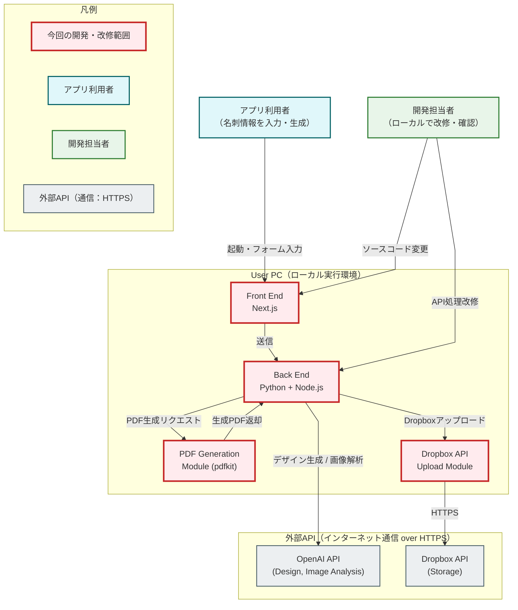

```mermaid
%%{init: {'theme': 'default', 'flowchart': { 'curve': 'linear', 'nodeSpacing': 50, 'rankSpacing': 50 }}}%%
flowchart TD

    %% スタイル定義
    classDef user fill:#E0F7FA,stroke:#006064,stroke-width:2px
    classDef dev fill:#E8F5E9,stroke:#2E7D32,stroke-width:2px
    classDef api fill:#FFF3E0,stroke:#EF6C00,stroke-width:2px
    classDef external fill:#ECEFF1,stroke:#455A64,stroke-width:1.5px
    classDef highlight fill:#FFEBEE,stroke:#C62828,stroke-width:3px

    %% ユーザー・開発者
    User["アプリ利用者<br/>（名刺情報を入力・生成）"]:::user
    Dev["開発担当者<br/>（ローカルで改修・確認）"]:::dev

    %% ローカル環境
    subgraph UserPC_LocalEnvironment["User PC（ローカル実行環境）"]
        UI["Front End<br/>Next.js"]:::highlight
        API["Back End<br/>Python + Node.js"]:::highlight
        PDFGen["PDF Generation<br/>Module (pdfkit)"]:::highlight
        DropUpload["Dropbox API<br/>Upload Module"]:::highlight
    end

    %% 外部API
    subgraph ExternalAPI["外部API（インターネット通信 over HTTPS）"]
        OpenAI["OpenAI API<br/>(Design, Image Analysis)"]:::external
        Dropbox["Dropbox API<br/>(Storage)"]:::external
    end

    %% アクセス経路
    User -->|起動・フォーム入力| UI
    UI -->|送信| API
    API -->|PDF生成リクエスト| PDFGen
    PDFGen -->|生成PDF返却| API
    API -->|Dropboxアップロード| DropUpload
    DropUpload -->|HTTPS| Dropbox
    API -->|デザイン生成 / 画像解析| OpenAI

    %% 開発者の経路
    Dev -->|ソースコード変更| UI
    Dev -->|API処理改修| API

    %% 凡例
    subgraph Legend["凡例"]
        A1["今回の開発・改修範囲"]:::highlight
        A2["アプリ利用者"]:::user
        A3["開発担当者"]:::dev
        A4["外部API（通信：HTTPS）"]:::external
    end
```
